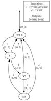

# RoCon tool

A python tool to generate state machines graphs and verilog code using high level description

## Features

### 1. Graph
state machine graph which depicts the state transitions conditions and outputs which is derived from the high level description

### 2. Verilog
.v file containing synthesizable verilog code which is derived from the high level description

    module ctrl #() (                               
        // General //
        input wire [0:0] clk,
        input wire [0:0] rst_n,
        // Inputs //
        input wire [0:0] clear,
        input wire [0:0] valid,
        input wire [0:0] aram,
        input wire [0:0] erim,
        // Outputs //
        output reg [0:0] done,
        output reg [1:0] count
    );

### 3. Parsing 
support for multiple conditions in a single line, handles white spaces and brackets:

This is fine:
    cat !=   1
And this is also fine:
    not (cat=1)

### 4. Interface inferring
interface does not have to be declared but is inferred from the archs definitions including name and required width in bits

For example, defining this arch:
    arch = arch('IDLE', 'S1', 'valid = 1 and clear = 0', 'count = 3')
Will cause:
    a. 1-bit-wide 'valid' and 'clear' inputs to be inferred
    b. 2-bit-wide 'count' output to be inferred

### 5. Condition comparing
equivalent conditions, even if written in different manners, are merged into a single condition to simplfy graph presentation

For example, this condition:
    cat = 0 and dog = 1
Will be merged with the following condition:
    not ((cat = 1) or (dog = 0))

## PLACEHOLDER 2

Other words here.