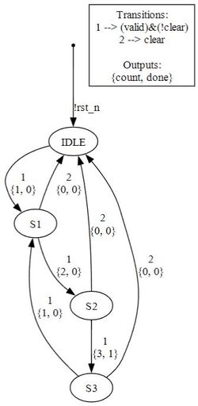
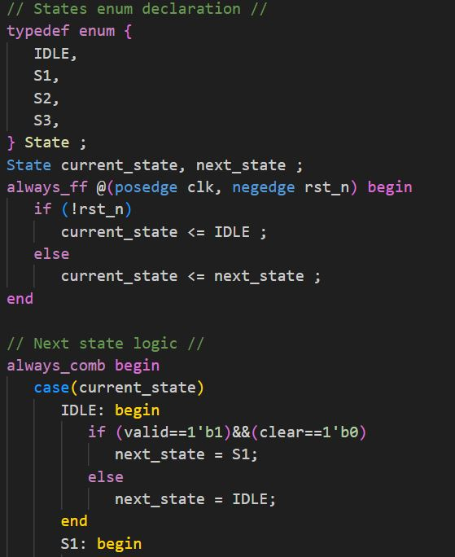

# RoCon tool

A python tool to generate state machines graphs and verilog code using high level description

## Features

### 1. High-level description
Only archs are required for a full description of a state machine. For example, this is a valid description:  
```python
    a0 = arch('IDLE', 'S1'  , 'valid = 1 and clear = 0            ', 'count = 1             ')
    a1 = arch('S1'  , 'S2'  , '(not valid = 0) and clear = 0      ', 'count = 2             ')
    a2 = arch('S2'  , 'S3'  , 'valid = 1 and (not clear = 1)      ', 'count = 3 and done = 1')
    a3 = arch('S3'  , 'S1'  , '(not valid = 0) and (not clear = 1)', 'count = 1             ')
    a4 = arch('S3'  , 'IDLE', 'clear = 1                          ', 'count = 0             ')
    a5 = arch('S2'  , 'IDLE', 'clear = 1                          ', 'count = 0             ')
    a6 = arch('S1'  , 'IDLE', 'clear = 1                          ', 'count = 0             ')
```

### 2. Graph
state machine graph which depicts the state transitions conditions and outputs which is derived from the high level description



### 3. Verilog
.v file containing synthesizable verilog code which is derived from the high level description  


 
### 4. Parsing 
support for multiple conditions in a single line, handles white spaces and brackets:

This is fine: 
```python 
    'cat !=   1  '
```
And this is also fine:  
```python
    'not(cat=1)'
```

### 5. Interface inferring
interface does not have to be declared but is inferred from the archs definitions including name and required width in bits

For example, defining this arch:  
```python
    arch = arch('IDLE', 'S1', 'valid = 1 and clear = 0', 'count = 3')  
```
Will cause:  
    a. 1-bit-wide 'valid' and 'clear' inputs to be inferred  
    b. 2-bit-wide 'count' output to be inferred  

### 6. Condition comparing
Equivalent conditions, even if written in different manners, are merged into a single condition to simplfy graph presentation  

For example, this condition:    
```python
    'cat = 0 and dog = 1'  
```
Will be merged with the following condition:  
```python
    'not ((cat = 1) or (dog = 0))'  
```

### 7. RHS signals
Names that appear in the right-hand-side of equations are treated as input and added to the module and graph.
In addition, all previously described features work for this type of conditions as well.

For example, this condition:    
```python
    'in_a = x and in_b = y'  
```
Will be merged with the following condition:  
```python
    'not ((in_a != x) or (in_b != y))'    
```   
And both 'x' and 'y' will be treated as inputs in addition to 'in_a' and 'in_b'

## Usage

1. To use the above features one needs to define an instance of the class 'fsm'.  

2. The class constructor is shown here:  
```python
    def __init__(self, arch_list: List[arch], default_state=None, clock=None, reset=None) -> None:  
```
- 'arch_list' is a list of instances of a class named 'arch'. 
  - 'source' and 'dest' are the source and destination states of the arch. For basic usage stick with sending strings containg desired state name.  
  - 'cond_str' is the condition which trigers the transition between source and dest, examples can be seen in the above feature description.  
  - 'out_str' describes the desired outputs for the transition, examples can be seen in the above feature description.  
  - The 'arch' class constructor is shown here:  
  ```python
       def __init__ (self, source: type[state]|str, dest: type[state]|str, cond_str: str, out_str: str) -> None:
  ```
- 'default_state' - optional, name of default state, if none is specified use first source state in first arch_list in fsm  
- 'clock' - optional, name of clock signal, if none is specified use 'clk'  
- 'reset' - optional, name of reset signal, if none is specified use 'rst_n'  

3. For advanced usage, one can access the following internal values of the 'fsm' class:  
- input_list - a List of 'input' base class instances, each containing:  
  - name - string, input signal name  
  - width - int, input signal width in bits  
- output_list - a List of 'input' base class instances, each containing:  
  - name - string, output signal name  
  - width - int, output signal width in bits  
  - default - int, output signal default value  
- states - a List of 'state' base class instances, each containing:  
  - name - string, state name  
  - default - bool, True if this state is a default state

4. See examples/examples.py for examples