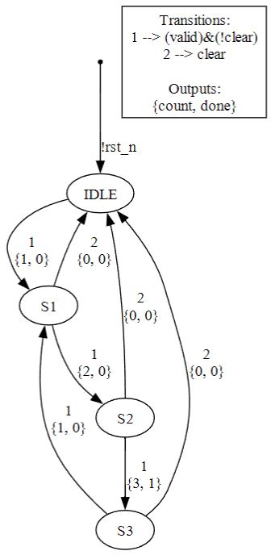

# RoCon tool

A python tool to generate state machines graphs and verilog code using high level description

## Features

### 1. High-level description
Only archs are required for a full description of a state machine. For example, this is a valid description:  

    '''
    a0 = arch('IDLE', 'S1'  , 'valid = 1 and clear = 0            ', 'count = 1             ')
    a1 = arch('S1'  , 'S2'  , '(not valid = 0) and clear = 0      ', 'count = 2             ')
    a2 = arch('S2'  , 'S3'  , 'valid = 1 and (not clear = 1)      ', 'count = 3 and done = 1')
    a3 = arch('S3'  , 'S1'  , '(not valid = 0) and (not clear = 1)', 'count = 1             ')
    a4 = arch('S3'  , 'IDLE', 'clear = 1                          ', 'count = 0             ')
    a5 = arch('S2'  , 'IDLE', 'clear = 1                          ', 'count = 0             ')
    a6 = arch('S1'  , 'IDLE', 'clear = 1                          ', 'count = 0             ')
    '''

### 2. Graph
state machine graph which depicts the state transitions conditions and outputs which is derived from the high level description

### 3. Verilog
.v file containing synthesizable verilog code which is derived from the high level description  
    
    '''
    //| Name: ctrl.sv                            |//
    //| Date: 2024-02-24                         |//
    //| Description: Automatically generated FSM |//
    //| Generated using RoControl python package |//
                                                    
    module ctrl #() (                               
        // General //
        input wire [0:0] clk,
        input wire [0:0] rst_n,
        // Inputs //
        input wire [0:0] valid,
        input wire [0:0] clear,
        // Outputs //
        output reg [1:0] count,
        output reg [0:0] done
    );

    // States enum declaration //
    typedef enum {
        IDLE,
        S1,
        S2,
        S3,
    } State ;
    State current_state, next_state ;
    always_ff @(posedge clk, negedge rst_n) begin
    if (!rst_n)
        current_state <= IDLE ;
    else
        current_state <= next_state ;
    end

    // Next state logic //
    always_comb begin
    case(current_state)
        IDLE: begin
            if (valid==1'b1)&&(clear==1'b0)
                next_state = S1;
            else
                next_state = IDLE;
        end
        S1: begin
            if (!(valid==1'b0))&&(clear==1'b0)
                next_state = S2;
            else if clear==1'b1
                next_state = IDLE;
            else
                next_state = S1;
        end
        S2: begin
            if (valid==1'b1)&&(!(clear==1'b1))
                next_state = S3;
            else if clear==1'b1
                next_state = IDLE;
            else
                next_state = S2;
        end
        S3: begin
            if (!(valid==1'b0))&&(!(clear==1'b1))
                next_state = S1;
            else if clear==1'b1
                next_state = IDLE;
            else
                next_state = S3;
        end
    endcase
    end

    // Output logic //
    always_comb begin
    count = 2'b0 ;
    done = 1'b0 ;
    case(current_state)
        IDLE: begin
            if (next_state == S1)
                count==2'b1;
        end
        S1: begin
            if (next_state == S2)
                count==2'b10;
            if (next_state == IDLE)
                count==2'b0;
        end
        S2: begin
            if (next_state == S3)
                count==2'b11;
                done==1'b1;
            if (next_state == IDLE)
                count==2'b0;
        end
        S3: begin
            if (next_state == S1)
                count==2'b1;
            if (next_state == IDLE)
                count==2'b0;
        end
    endcase
    end

    endmodule:ctrl

    //| Enjoy!                                       |//
    '''

### 4. Parsing 
support for multiple conditions in a single line, handles white spaces and brackets:

This is fine:  
    '''
    cat !=   1  
    '''
And this is also fine:  
    '''
    not (cat=1)  
    '''

### 5. Interface inferring
interface does not have to be declared but is inferred from the archs definitions including name and required width in bits

For example, defining this arch:
    '''
    arch = arch('IDLE', 'S1', 'valid = 1 and clear = 0', 'count = 3')
    '''
Will cause:  
    a. 1-bit-wide 'valid' and 'clear' inputs to be inferred  
    b. 2-bit-wide 'count' output to be inferred  

### 6. Condition comparing
equivalent conditions, even if written in different manners, are merged into a single condition to simplfy graph presentation

For example, this condition:  
    '''
    cat = 0 and dog = 1
    '''
Will be merged with the following condition:  
    '''
    not ((cat = 1) or (dog = 0))  
    '''

## PLACEHOLDER 2

Other words here.